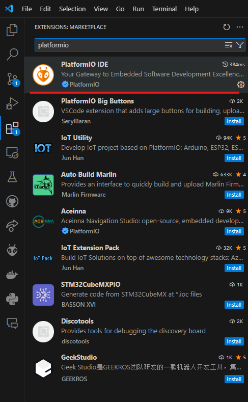
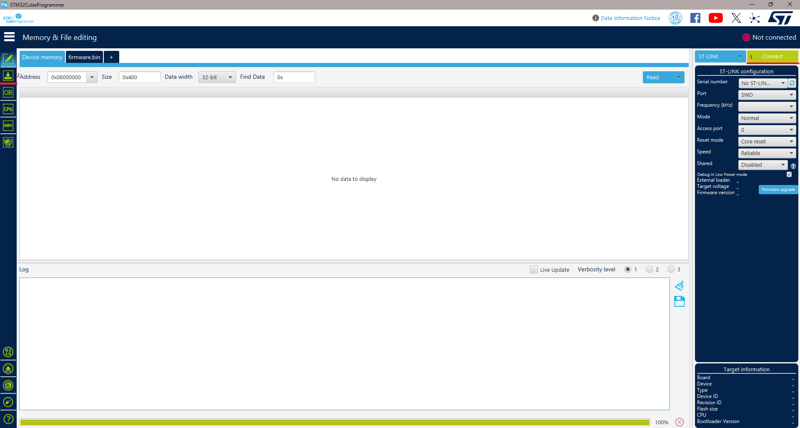

# TunePulse Firmware

[](https://github.com/creapunk/TunePulse/blob/main/LICENSE)
[](https://platformio.org/)
[](https://discord.gg/V4aJdTja8v)
[](https://ko-fi.com/creapunk)

**TunePulse** is an upcoming open-source firmware designed to

- control a wide range of motors (`DC`, `STEPPERS`, `BLDC`, `PMSM`, `LINEAR`)
- across various control modes (`CLOSED-LOOP`, `FOC`, `POSITION`, `SPEED`, `TORQUE`, etc.)
- featuring compatibility with multiple interfaces (`STEP-DIR`, `UART`, `I2C`, `CAN/CAN-FD`, `USB`)
- and support for various protocols (`GCODE`, `KLIPPER`, etc.).

Its primary goal is to advance the development of closed-loop systems and simplify their integration into existing systems.

> **Note: This firmware is under heavy development and currently has no documentation.
> For more information, join the creapunk community [Discord](https://discord.gg/V4aJdTja8v).**

## SETUP

### Applications:

- STMCubeProgrammer - https://www.st.com/en/development-tools/stm32cubeprog.html
- VSCode - https://code.visualstudio.com
- PlatformIO - (Install as VSCode extension, see image below)
  

### First Boot:

To generate the binary, pull the TunePulse repository from github. Be sure to switch to a branch that has a bootloader available if you want to remove the programmer from the loop. Make sure the PlatformIO extension is installed for building.

Use the command pallete and run the command `PlatformIO: Pick Project Environment`. Be sure to pick the correct target device. Once done, you can run the `PlatformIO: Build` to generate target binaries. These binaries will be in the local directory `.pio/build/target_release/firmware.bin`.

The first binary has to be flashed using the STM Programmer. Attach a USB cable from a computer to the flashing hardware into the port that says ST-LINK. Then connect the single usb-c port to the driver board using the full function usb-c cable (direction matters here, if the next step fails, flip the cable).

To flash, open up STM32CubeProgrammer applciation. In the screenshot below, the connect button is marked 1. Click that and ensure the device connects properly. If it fails, flip the usb-c cable and try again. You will know it is connected if you see hex data fill up the window. Next click the botton on the left labeled 2 in the screenshot below.



In this next menu, simply browse for your binary file from the path above, and click the Start Programming button. This should have properly flashed the device and you are all set for further testing.

### Target defines

For specific targets:

```c
#define TARGET_CLN17_V1_5 # CLN17 v1.5
#define TARGET_CLN17_V2 # CLN17 v2
```

For specific features:

```c
// #define FEATURE_CANFD # CAN FD communication
```

## Contribution

See `CONTRIBUTION.md`
